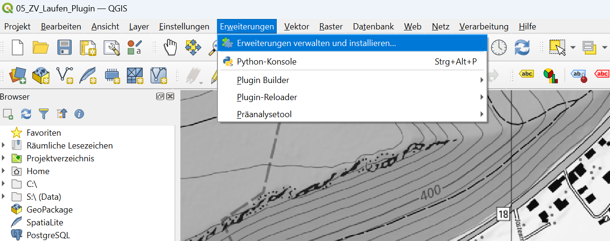
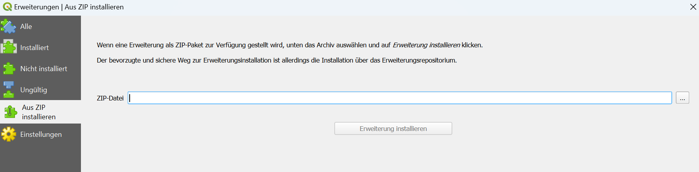
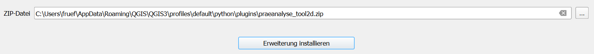

# Installationsanleitung

Das Plug-in wurde mit der QGIS-Version 3.34 (LTR) getestet. Bei Verwendung einer anderen QGIS-Version kann die Funktionstüchtigkeit nicht garantiert werden.

## 1. QGIS installieren

Installieren Sie die Version 3.34 (LTR) von QGIS. [Link](https://download.qgis.org/downloads/QGIS-OSGeo4W-3.34.4-1.msi)

## 2. Erweiterung installieren

Das Plug-in wurde bisher nicht in der Plug-in-Cloud von QGIS veröffentlicht. Daher muss es als .zip-Datei installiert werden. Falls Sie diese Datei nicht besitzen, könne Sie diese beim Institut Geomatik der Fachhochschule anfragen: [geomatik-studieren.ch](https://geomatik-studieren.ch)

1. Navigieren Sie zu _Erweiterungen_ → _Erweiterungen verwalten und installieren..._
 

2. Es öffnet sich ein neues Fenster. Klicken Sie hier auf _Aus ZIP installieren_

3. Klicken Sie auf den Knopf _..._ und wählen die .zip-Datei aus. Klicken Sie anschliessend auf _Erweiterung installieren_

