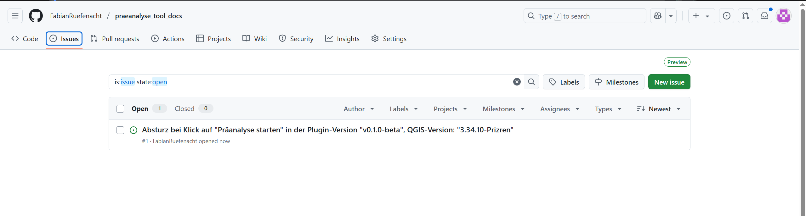
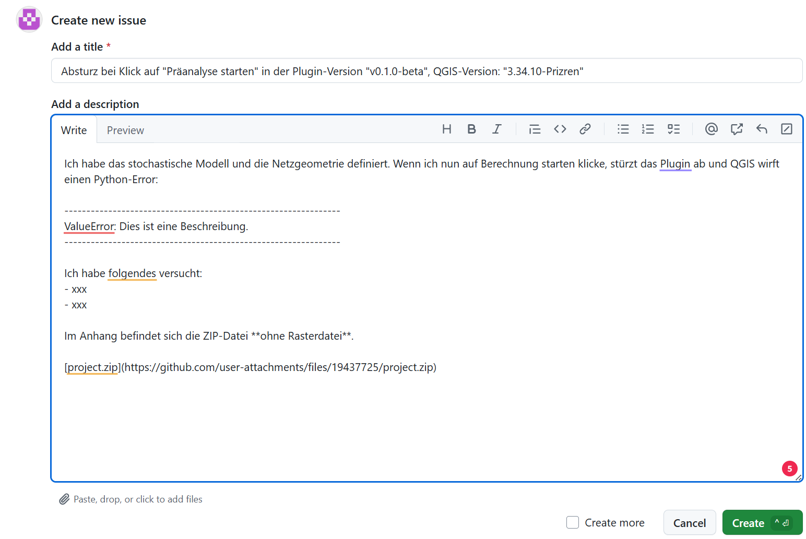

# Bug-Report

Haben Sie einen Fehler bemerkt? Haben Sie Fragen zur Implementierung? Stürzt das Plugin ab oder verhält es sich unerwartet?

Bei der Entwicklung eines solchen Plugins gibt es zahlreiche potenzielle Fehlerquellen. Daher bin ich für jede Rückmeldung dankbar. Bitte erfassen Sie einen möglichst detaillierten und aussagekräftigen Issue auf GitHub. So funktioniert es:

1. **Navigieren Sie zum GitHub-Repository dieser Dokumentation:**  
   [GitHub-Repository](https://github.com/FabianRuefenacht/praeanalyse_tool_docs)
2. **Erstellen Sie einen neuen Issue:**  
    Klicken Sie auf ```Issues``` und anschließend auf ```New issue``` (siehe Abbildung 1).
3. **Beschreiben Sie den Fehler ausführlich:**  
    Geben Sie einen prägnanten Titel an.  
    Beschreiben Sie genau, unter welchen Umständen der Fehler auftritt.  
    Falls möglich, hängen Sie Ihr Projekt als ```zip-Datei``` an (siehe Abbildung 2).
4. **Erstellen Sie den Issue:**  
    Klicken Sie auf ```Create issue``` (siehe Abbildung 2).
5. **Ich werde den Fehler prüfen und mich gegebenenfalls mit einer Rückmeldung bei Ihnen melden.**

---

<br/>
<small>_Abbildung 1: So melden Sie einen Bug._</small>

---

<br/>
<small>_Abbildung 2: So beschreiben Sie einen Bug richtig._</small>
