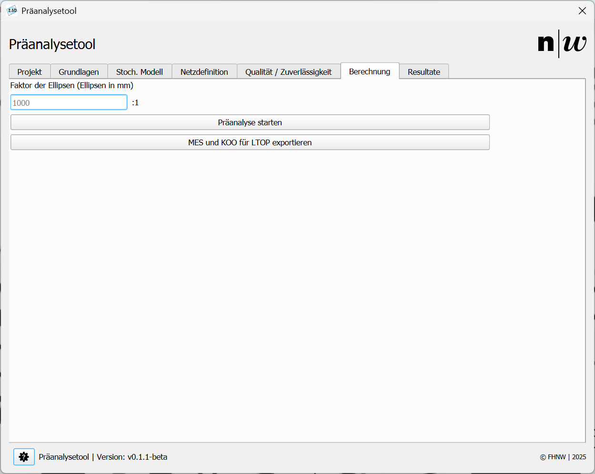

# Berechnung

Im Register ```Berechnung``` wird die Berechnung gestartet. Es gibt nur eine Einstellung, die hier vorgenommen werden muss:

<br/>
<small>_Abbildung 1: Register Berechnung._</small>

- **Faktor der Ellipsen:** Dieser beschreibt, wie stark die Ellipsen skaliert werden sollen, bevor sie in die Zeichnung geladen werden. Diese Einstellung beeinflusst nicht die numerischen Ergebnisse, sondern lediglich deren Darstellung.

## Präanalyse starten

Mit Klick auf den Knopf ```Präanalyse starten``` wird die Berechnung durchgeführt. Die Präanalyse erfolgt getrennt für Lage und Höhe. 

Bevor die Berechnung gestartet wird, prüft das Programm die Netzkonfiguration. Falls Fehler vorliegen, werden diese in einem Pop-up-Fenster angezeigt. Nach der Validierung der allgemeinen Netzgeometrie erfolgt eine spezifische Validierung für die Lageausgleichung. Ein Fehler in dieser Prüfung führt nicht zwingend zum Abbruch der Berechnung, da möglicherweise die Höhenberechnung dennoch durchgeführt werden kann. Anschliessend wird die Netzgeometrie für die Höhenberechnung geprüft. Auch hier gilt: Falls Fehler auftreten, werden diese als Pop-up angezeigt, und die Lageberechnung kann gegebenenfalls trotzdem erfolgen.

Nach erfolgreichem Abschluss der Berechnungen erscheint eine Meldung, die den Erfolg bestätigt. Die Resultate werden nun im Plugin im Register ```Resultate``` sowie in der QGIS-Zeichenoberfläche als Layer dargestellt. Zudem ist das Berechnungsprotokoll als HTML-Datei im Ordner ```results``` gespeichert, wie im Abschnitt [Projekt eröffnen](../open_project) beschrieben.

---

## MES und KOO für LTOP exportieren

Ein Klick auf den Knopf ```MES und KOO für LTOP exportieren``` schreibt die Netzdefinition (.mes) und Näherungskoordinaten (.koo) für die Weiterverwendung mit LTOP. Die Richtigkeit der exportierten Dateien wurde mit der Software GeoSuite, Version 1.6.5031 getestet.

Die exportierten Dateien finden Sie im Ordner der verwendeten Version mit den Namen ```VERSION.mes``` und ```VERSION.koo```.

Beispiel-Ordner für ein Projekt mit dem Name *Praeanalyse* und der Version *Version1*:
- ```...\Praeanalyse\Version1\1.mes```
- ```...\Praeanalyse\Version1\1.koo```
