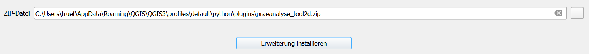

# Installation

Das Plug-in wurde mit der QGIS-Version 3.42.3-Münster (Qt6) getestet. Bei Verwendung einer anderen QGIS-Version kann die Funktionstüchtigkeit nicht garantiert werden.

## QGIS installieren

Installieren Sie die Version **3.42.3-Münster (Qt6)** von QGIS. ([download.qgis.org/downloads/](https://download.qgis.org/downloads/))

## Plugin installieren

Das Plug-in wurde bisher nicht in der Plug-in-Cloud von QGIS veröffentlicht. Daher muss es als .zip-Datei installiert werden.

- Navigieren Sie zu _Erweiterungen_ → _Erweiterungen verwalten und installieren..._ (Abbildung 1)

   
  <small>_Abbildung 1: Erweiterungen installieren._</small>

- Es öffnet sich ein neues Fenster. Klicken Sie hier auf _Aus ZIP installieren_ (Abbildung 2)

   
  <small>_Abbildung 2: Aus ZIP installieren._</small>

- Klicken Sie auf den Knopf _..._ in Abbildung 3 und wählen Sie die .zip-Datei aus. Klicken Sie anschliessend auf _Erweiterung installieren_.

   
  <small>_Abbildung 3: Erweiterung auswählen und installieren._</small>

- Falls eine Fehlermeldung auftaucht, prüfen Sie ob Sie die richtige Version von QGIS verwenden und ob sich nicht bereits ein Plug-in mit demselben Namen im _plugins_-Verzeichnis von QGIS befindet.

- Wenn keine Fehlermeldung aufgetreten ist, sollte die Erweiterung in der _Plug-in-Leiste_ (Abbildung 4) auftauchen

   
  <small>_Abbildung 4: Plug-in erfolgreich installiert._</small>

Sie können die Erweiterung nun mit Klick auf das Icon starten. Viel Spass mit der Präanalyse!

---
