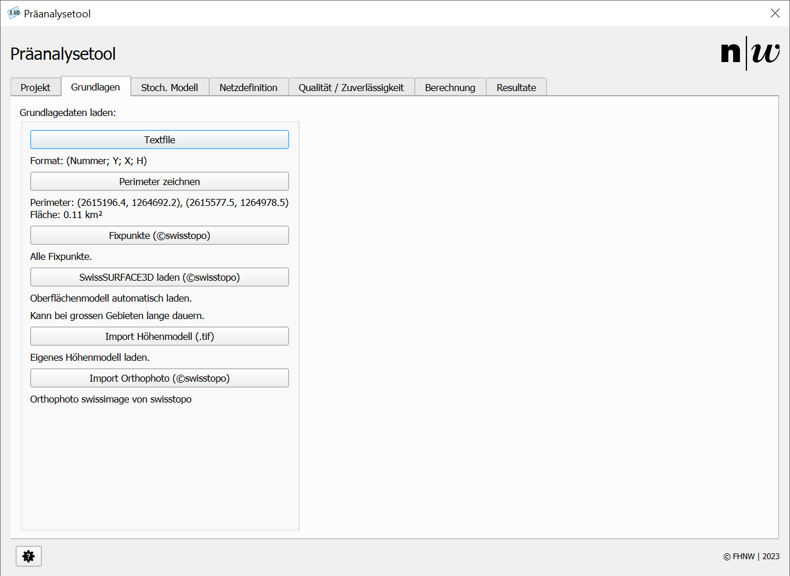

# Grundlagedaten beziehen

Für die Planung von geodätischen Netzen werden Grundlagedaten wie Fixpunkte der amtlichen Vermessung benötigt. Für ein effizientes und einfaches Netzdesign sind Höheninformationen - um die Sichtbarkeit oder Abschottung von Punkten zu analysieren und Referenzdaten - um sich in der Umgebung des Netzes zurecht zu finden hilfreich. Im Register ```Grundlagen``` können diese Daten importiert oder aus zentralisierten Quellen bezogen werden.

<br/>
<small>_Abbildung 1: Register Grundlagen._</small>

---

## Fixpunkte aus Textfile laden

Der Knopf ```Textfile``` ermöglicht den Import von eigenen Punkten. Diese Punkte können als Referenz- oder Neupunkte im Netzdesign verwendet werden.

Der Datensatz muss wie folgt aufgebaut sein:

- kein Header -> die erste Zeile muss bereits Punktdaten erhalten
- Punktnummer;Ost-Koordinate;Nord-Koordinate;Höhe
- Als Trennzeichen wird der Semikolon ```;``` verwendet
- Fehlende Höhen sind mit ```0``` als Platzhalter zu ergänzen
- Punktnummern dürfen keine Sonder- oder Leerzeichen enthalten

---

## Permieter zeichnen
Der Perimeter ist die Grundlage für den Bezug der öffentlichen Geodaten (Fixpunkte und Oberflächenmodell).
- Der Klick auf den Knopf Perimeter zeichnen aktiviert das Zeichnen in der Zeichenoberfläche von QGIS.
- Beim ersten Klick in der Zeichenoberfläche wird die erste Ecke einer Bounding-Box aktiviert. Mit dem zweiten Klick - wird die Bounding-Box abgeschlossen. Während dem Zeichnen wird ein RubberBand (provisorische Bounding Box) dargestellt.
- Anschliessend werden die Koordinaten und die Fläche des Perimeters berechnet und unterhalb des Knopfes in der Benutzeroberfläche des Plug-ins dargestellt.

---

## Fixpunkte (©swisstopo)

Wenn ein Perimeter definiert wurde, können Sie mit Klick auf den Knopf Fixpunkte (©swisstopo) alle Fixpunkte (LFP1-3 & HFP 1-3) von swisstopo herunterladen. Die Daten werden aus dem WFS der swisstopo heruntergeladen [(geodienste o,J.)](https://www.geodienste.ch/services/av/info).

**Achtung:** Diese Option ist zum aktuellen Stand (23.03.2025) noch nicht in der ganzen Schweiz verfügbar.

---

## SwissSURFACE3D laden (©swisstopo)

Das Höhenmodell kann anschliessend für die Sichtbarkeitsanalyse verwendet werden. **Beachten:** Sie können nur ein Höhenmodell laden.

- Wenn ein Perimeter definiert wurde, können Sie mit Klick auf den Knopf SwissSURFACE3D laden (©swisstopo) das - Oberflächenmodell der Schweiz SwissSURFACE3D im definierten Perimeter laden. [(swisstopo 2024)](https://www.swisstopo.admin.ch/de/hoehenmodell-swisssurface3d-raster)
- Beachten Sie, dass der Bezug des Oberflächenmodells je nach Ausdehnung des Perimeters und Leistungsfähigkeit Ihres Computers lange dauern kann. Ausserdem ist das Oberflächenmodell SwissSURFACE3D zum Stand der Erstellung dieser Anleitung bisher nicht flächendeckendverfügbar. Falls kein Raster geladen wird, prüfen Sie die Verfügbarkeit hier: [www.swisstopo.admin.ch](https://www.swisstopo.admin.ch/de/hoehenmodell-swisssurface3d-raster).

---

## Import Höhenmodell (.tif)

Das Höhenmodell kann anschliessend für die Sichtbarkeitsanalyse verwendet werden. **Beachten:** Sie können nur ein Höhenmodell laden.

- Mit dieser Funktion können Sie ihre eigene Rasterdatei in das Projekt laden.
- Beachten Sie, dass Sie nur eine Rasterdatei pro Projekt besitzen können. Die älteren Dateien werden jedes Mal - überschrieben. Verwenden Sie nicht den Standard-Import von QGIS. Die Rasterdatei muss einem spezifischen Namen - folgen, um im Plug-in verwendet werden zu können.
- Falls Sie mehrere Rasterdateien benötigen, müssen Sie diese bei dieser Option zuerst zu einer Datei zusammenfügen. [Anleitung](https://docs.qgis.org/3.40/de/docs/user_manual/processing_algs/gdal/rastermiscellaneous.html#merge)

## Import Orthophoto

...