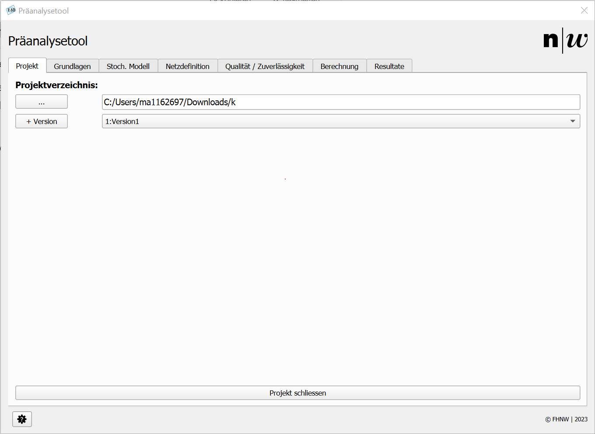

# Projekt erstellen & öffnen

Beim Starten des Plugins müssen Sie ein Projekt auswählen oder ein neues Projekt erstellen.

## Projekt wählen / erstellen

- Klicken Sie auf die drei Punkte, um einen Projektordner auszuwählen.
- Enthält der Ordner bereits ein bestehendes Projekt, wird dieses automatisch geladen.
- Enthält der Ordner **kein** Projekt, wird die Ordnerstruktur für das Projekt erstellt.

---

## Version auswählen

Das Plugin unterstützt eine Versionskontrolle, wodurch Sie in jedem Projekt verschiedene Versionen speichern können:

- Klicken Sie auf den Button ```+ Version```, um eine neue Version hinzuzufügen.
- Ein neues Fenster öffnet sich, in dem Sie der Version einen Namen geben können. Zusätzlich können Sie wählen, ob die bestehenden Einstellungen übernommen werden sollen. **Hinweis:** _Diese Funktion befindet sich noch in der Entwicklung und kann zu Problemen führen!_
- Nach dem Erstellen der Version können Sie sie aus dem Drop-Down-Menü neben dem Erstellungs-Button auswählen.
- Wenn eine Version ausgewählt wurde, werden die zugehörigen Layer in die QGIS-Zeichenfläche geladen und alle Einstellungen des Projekts werden auf die Anwendung angewendet.

---

## Projekt schließen

Der Button am unteren Rand des Plugin-Fensters schließt das Projekt. Beim Schließen des Projekts werden alle Daten aus der QGIS-Zeichenoberfläche entfernt, und das Plugin wird kontrolliert beendet.

---

Die folgende Abbildung 1 zeigt die Startmaske des Plugins. In **Tabelle 1** ist die Ordnerstruktur des gewählten Verzeichnisses schematisch dargestellt.

{ width=500 }
<small>_Abbildung 1: Neues Projekt erstellen._</small>


| Symbol         | Ordner / Datei                     | Beschreibung                                                    |
|----------------|------------------------------------|-----------------------------------------------------------------|
| 📁 PROJECTFOLDER | Hauptordner des Projektes         | Der übergeordnete Ordner, der alle Projektdateien enthält.      |
| 📁 Version1     | Verzeichnis mit allen Daten der Version | Enthält alle Daten und Konfigurationen für Version 1.            |
|   📁 cfg        | Weitere Einstellungen              | Enthält Dateien mit weiteren Einstellungen für das Plugin. _Bitte nicht bearbeiten!_ |
|   📁 results    | Resultate der Präanalyse           | Enthält sämtliche Berechnungsresultate als Geopackage-Layer oder HTML-Datei. Diese Dateien können auch von anderer Software verwendet werden. |
|   📁 vectorlayers | Layer der Netzkonfiguration        | Enthält sämtliche Layer, die für die Netzkonfiguration notwendig sind. |
| 📁 raster       | Geladenes Höhenmodell              | Enthält die Rasterdaten des Höhenmodells für das Projekt.       |
| 💾 database.sqlite | Datenbank mit Netzkonfiguration    | Die SQLite-Datenbank, die alle Netzkonfigurationsdaten speichert. |
<small>_Tabelle 1: Projektverzeichnis._</small>
