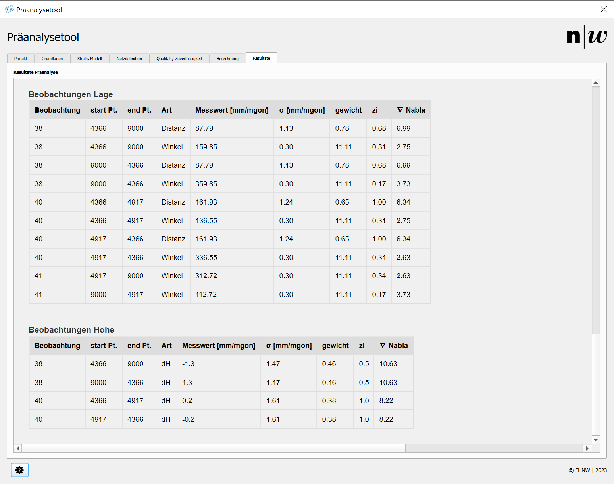

# Resultate

Die Resultate werden sowohl im Reiter ```Resultate``` als auch in der QGIS-Zeichenoberfläche dargestellt. Die Abbildung 1 zeigt das Register ```Resultate```.

<br/>
<small>_Abbildung 1: Register Resultate._</small>

## Protokoll

Das letzte Register ```Resultate``` stellt das Protokoll dar, das im Ordner ```projectname/version/results/``` als HTML-Datei gespeichert ist.

Da die Darstellung im Plugin technisch bedingt nicht optimal ist, wird empfohlen, die genaue Beurteilung des Netzes im bevorzugten Webbrowser durchzuführen.

Das Protokoll ist wie folgt gegliedert:

- **Genauigkeit und Zuverlässigkeit der Neupunkte:** Auflistung aller Neupunkte mit Angaben zur Genauigkeit und Zuverlässigkeit in Lage und Höhe.
- **Relative Genauigkeit und Zuverlässigkeit:** Auflistung der Ergebnisse der relativen Konfigurationen.
- **Genauigkeit der Punkthöhen:** Darstellung der Punkthöhen mit Standardabweichungen und äusserer Zuverlässigkeit.
- **Beobachtungen Lage:** Tabelle mit allen Beobachtungen zur Lagebestimmung. Pro Beobachtung werden folgende Attribute aufgeführt:  
  ```Messwert; Start; End; Messart; Messwert; Standardabweichung; Gewicht; lokale Zuverlässigkeit; innere Zuverlässigkeit```.
- **Beobachtungen Höhe:** Tabelle mit allen Beobachtungen zur Höhenbestimmung. Pro Beobachtung werden folgende Attribute aufgeführt:  
  ```Messwert; Start; End; Messart; Messwert; Standardabweichung; Gewicht; lokale Zuverlässigkeit; innere Zuverlässigkeit```.

## QGIS-Zeichenoberfläche

Zusätzlich zum Protokoll werden in der QGIS-Zeichenoberfläche die relativen und absoluten mittleren Konfidenzellipsen sowie die relativen und absoluten äusseren Zuverlässigkeitsrechtecke dargestellt.

**Hinweis:** Im nächsten Release sollen Filterfunktionen für die Netzbeurteilung hinzugefügt werden, um die Auswertung weiter zu vereinfachen.
