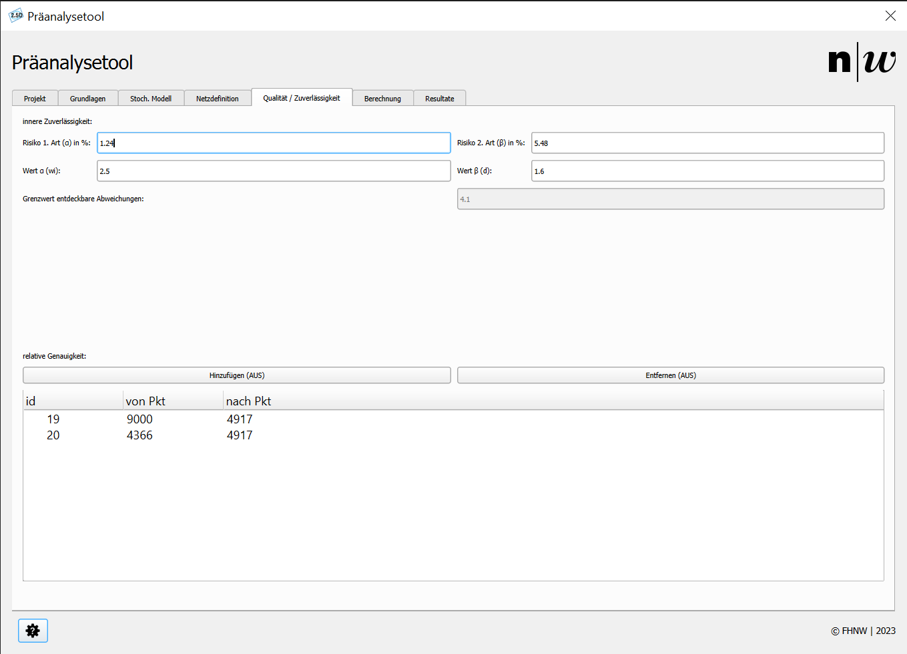

# Qualität und Zuverlässigkeit

In der Registerkarte **Qualität / Zuverlässigkeit** können Sie die Einstellungen zur Zuverlässigkeit sowie zur Analyse der relativen Genauigkeit und Zuverlässigkeit vornehmen. Abbildung 1 zeigt das Register ```Qualität/Zuverlässigkeit```.

<br/>
<small>_Abbildung 1: Register Qualität und Zuverlässigkeit._</small>

---

## Innere Zuverlässigkeit

Die Einstellungen in der oberen Hälfte des Fensters beziehen sich auf die **innere** und die **äussere** Zuverlässigkeit. 

- **Risiko 1. Art (α):**  
  Geben Sie das Risiko 1. Art an → ```wi``` wird berechnet.  
  Alternativ können Sie ```wi``` eingeben → Das Risiko 1. Art wird berechnet.

- **Risiko 2. Art (β):**  
  Geben Sie das Risiko 2. Art an → ```d``` wird berechnet.  
  Alternativ können Sie ```d``` eingeben → Das Risiko 2. Art wird berechnet.  

- Aus den entsprechenden Werten wird der **Grenzwert für entdeckbare Fehler (Bias)** berechnet.

---

## Relative Genauigkeit und relative Zuverlässigkeit

Die untere Hälfte des Fensters ermöglicht es, **relative Genauigkeiten** und **relative Zuverlässigkeiten** zu erfassen.

### Hinzufügen

Ein Klick auf den Knopf ```Hinzufügen``` aktiviert das Digitalisieren der Konfiguration. Ein weiterer Klick auf diesen Knopf beendet die Funktion.

- Wählen Sie einen Punkt aus dem Layer ```reference_points``` aus.
- Bei jeder Mausbewegung wird das **RubberBand** aktualisiert.
- Nachdem der zweite Punkt ausgewählt wurde, wird die Konfiguration durch eine gestrichelte Linie symbolisiert.
- Die Konfiguration wird ausserdem in der Liste unterhalb des Knopfes im Plugin dargestellt.

### Entfernen

Ein Klick auf den Knopf ```Entfernen``` aktiviert das Löschen von Konfigurationen. Ein weiterer Klick auf diesen Knopf beendet die Funktion.

- Wählen Sie eine Konfiguration aus dem Layer ```rel_analysis_cfg```.
- Sie werden aufgefordert, die Löschung der Konfiguration zu bestätigen.
- Nach der Bestätigung wird die Linie aus der QGIS-Zeichenoberfläche entfernt.
