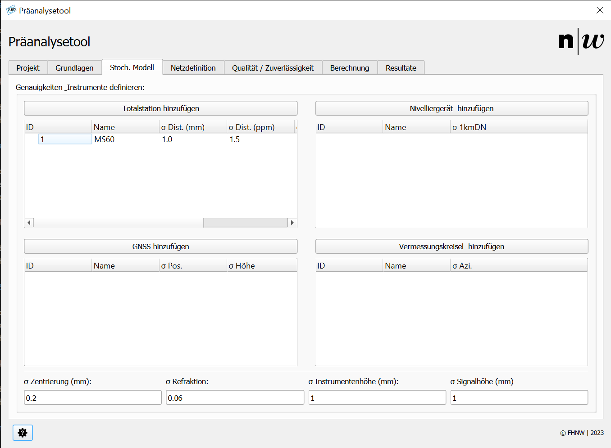

# Stochastisches Modell

Im Reiter ```stoch. Modell``` (Abbildung 1) werden die Instrumente und die Instrumentenunabhängigen Genauigkeiten definiert. Dieser Reiter erlaubt die Erstellung, Bearbeitung und das Löschen von Totalstationen, GNSS, Nivelliergeräten und Vermessungskreiseln. **Beachte:** bisher können nur Messungen von Totalstationen verarbeitet werden.

<br/>
<small>_Abbildung 1: Register Stoch. Modell._</small>

## Totalstationen

Der Knopf ```Totalstation hinzufügen``` öffnet ein neues Fenster, in welchem der Name des Instrumentes und die stochastischen Eigenschaften dessen eingegeben werden können. Nach der Bestätigung wird das Instrument der unter dem Knopf stehenden Liste hinzugefügt.

Rechtsklick auf ein Instrument in der Liste öffnet ein Kontextmenü, welches folgende Optionen bietet:

- bearbeiten eines Instruments: Name und stochastische Eigenschaften anpassen
- löschen eines Instruments: Entfernt das Instrument aus der Auswahl und aus der Datenbank

## Nivelliergerät

Der Knopf ```Nivelliergerät hinzufügen``` öffnet ein neues Fenster, in welchem der Name des Instrumentes und die stochastischen Eigenschaften dessen eingegeben werden können. Nach der Bestätigung wird das Instrument der unter dem Knopf stehenden Liste hinzugefügt.

Rechtsklick auf ein Instrument in der Liste öffnet ein Kontextmenü, welches folgende Optionen bietet:

- bearbeiten eines Instruments: Name und stochastische Eigenschaften anpassen
- löschen eines Instruments: Entfernt das Instrument aus der Auswahl und aus der Datenbank

## GNSS

Der Knopf ```GNSS hinzufügen``` öffnet ein neues Fenster, in welchem der Name des Instrumentes und die stochastischen Eigenschaften dessen eingegeben werden können. Nach der Bestätigung wird das Instrument der unter dem Knopf stehenden Liste hinzugefügt.

Rechtsklick auf ein Instrument in der Liste öffnet ein Kontextmenü, welches folgende Optionen bietet:

- bearbeiten eines Instruments: Name und stochastische Eigenschaften anpassen
- löschen eines Instruments: Entfernt das Instrument aus der Auswahl und aus der Datenbank

*Anwendungstipp Sessionen:* Üblicherweise werden GNSS-Messungen über sogenannte Sessionen ausgeglichen. Die Sessionen werden im QGIS-Plugin über die unterschiedlichen GNSS-Instrumente definiert. Sollen zwei Sessionen mit demselben GNSS gemessen werden, kann dasselbe Instrument einfach mehrfach (unter anderen Namen) erfasst werden. *Beispiel:*

| ID | Name | σ Pos. | σ Höhe |
| --- | --- | --- | --- |
| 1 | GS18i RTK1 | 10 | 20 |
| 2 | GS18i RTK2 | 10 | 20 |
| 3 | GS18i RSTS | 5 | 10 |
| 4 | GS18i STS | 3 | 5 |

## Vermessungskreisel

Der Knopf ```Vermessungskreisel hinzufügen``` öffnet ein neues Fenster, in welchem der Name des Instrumentes und die stochastischen Eigenschaften dessen eingegeben werden können. Nach der Bestätigung wird das Instrument der unter dem Knopf stehenden Liste hinzugefügt.

Rechtsklick auf ein Instrument in der Liste öffnet ein Kontextmenü, welches folgende Optionen bietet:

- bearbeiten eines Instruments: Name und stochastische Eigenschaften anpassen
- löschen eines Instruments: Entfernt das Instrument aus der Auswahl und aus der Datenbank

## Weitere Einstellungen

### σ Zentrierung (mm)

Hat derzeit keine Einwirkungen. Wird voraussichtlich im nächsten Release hinzugefügt.

### σ Refraktion

Standardabweichung der Refraktion. Standardwert = 0.06

### σ Instrumentenhöhe (mm)

Standardabweichung der Instrumentenhöhenbestimmung. Standardwert = 1 mm

### σ Signalhöhe (mm)

Standardabweichung der Signalhöhenbestimmung. Standardwert = 1 mm
