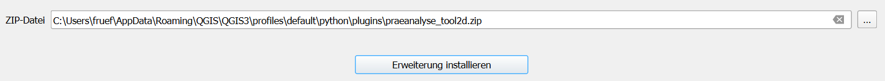
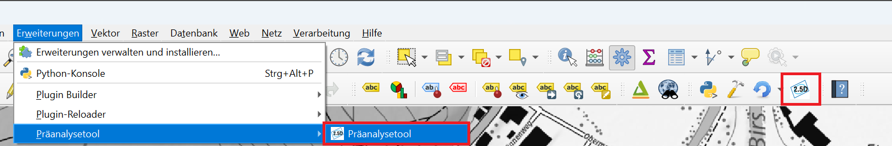
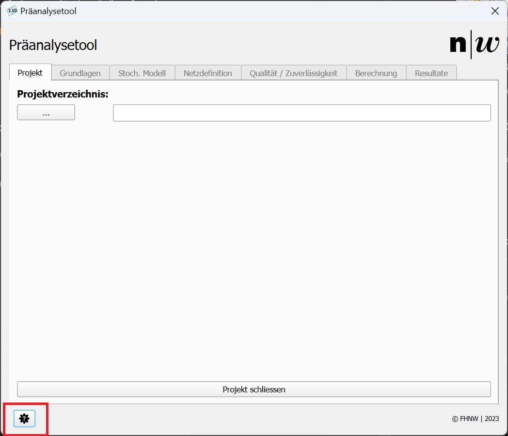
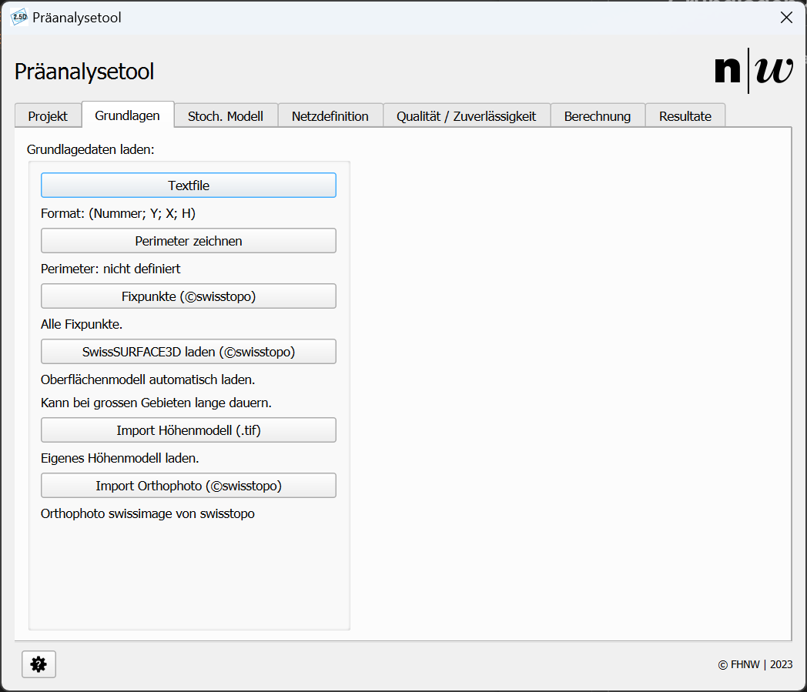
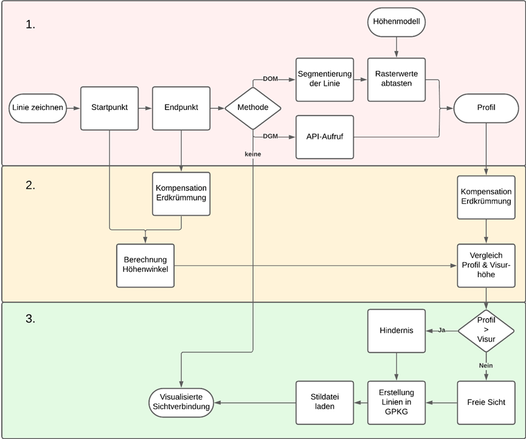

# Benutzerhandbuch Präanalysetool

## 1. Einleitung {#introduction}

Willkommen zum Benutzerhandbuch zum QGIS-Plug-in **Präanalysetool**.

Das Plug-in ermöglicht es, interaktiv ein geodätisches Netz zu planen und eine Präanalyse zu berechnen. Berechnen Sie die Lage- und Höhengenauigkeit, Zuverlässigkeit sowie die relative Genauigkeit und die relative Zuverlässigkeit zwischen zwei Neupunkten. Das Plug-in ist bisher auf terrestrische Messungen und hart gelagerte Netze beschränkt.

Es wird strengstens empfohlen, das digitale Handbuch zu verwenden! ([https://fabianruefenacht.github.io/praeanalyse_tool_docs/](https://fabianruefenacht.github.io/praeanalyse_tool_docs/))\
Klicken  Sie auf die Bilder, um diese zu vergrössern!

---

## 2. Installationsanleitung {#install}

Das Plug-in wurde mit der QGIS-Version 3.34 (LTR) getestet. Bei Verwendung einer anderen QGIS-Version kann die Funktionstüchtigkeit nicht garantiert werden.

### 2.1. QGIS installieren

Installieren Sie die Version 3.34 (LTR) von QGIS. ([download.qgis.org/downloads/](https://download.qgis.org/downloads/))

### 2.2. Erweiterung installieren

Das Plug-in wurde bisher nicht in der Plug-in-Cloud von QGIS veröffentlicht. Daher muss es als .zip-Datei installiert werden. Falls Sie diese Datei nicht besitzen, können Sie diese beim Institut Geomatik der Fachhochschule anfragen: [geomatik-studieren.ch](https://geomatik-studieren.ch)

- Navigieren Sie zu _Erweiterungen_ → _Erweiterungen verwalten und installieren..._ (Abbildung 1)
 \
_Abbildung 1: Erweiterungen installieren._

- Es öffnet sich ein neues Fenster. Klicken Sie hier auf _Aus ZIP installieren_ (Abbildung 2)
\
_Abbildung 2: Aus ZIP installieren._

- Klicken Sie auf den Knopf _..._ in Abbildung 3 und wählen Sie die .zip-Datei aus. Klicken Sie anschliessend auf _Erweiterung installieren_.
\
_Abbildung 3: Erweiterung auswählen und installieren._

- Falls eine Fehlermeldung auftaucht, prüfen Sie ob Sie die richtige Version von QGIS verwenden und ob sich nicht bereits ein Plug-in mit demselben Namen im _plugins_-Verzeichnis von QGIS befindet.

- Wenn keine Fehlermeldung aufgetreten ist, sollte die Erweiterung in der _Plug-in-Leiste_ (Abbildung 4) auftauchen
\
_Abbildung 4: Plug-in erfolgreich installiert._

Sie können die Erweiterung nun mit Klick auf das Icon starten. Viel Spass mit der Präanalyse!

---

## 3. Hilfe {#Help}

Bei geöffnetem Plug-in kann jederzeit die Hilfe geöffnet werden. Klicken Sie dazu auf den Knopf unten links im Plug-in-Fenster (Abbildung 5) oder drücken Sie die Taste _F1_.
\
_Abbildung 5: Hilfe öffnen._

---

## 4. Projekt eröffnen {#openProject}

In der Startmaske des Plug-ins muss ein Projekt gewählt werden.

- Klicken Sie auf die drei Punkte oder drücken Sie die Tastenkombination _STRG + O_ und wählen Sie einen Ordner aus.
- In diesem Ordner wird - falls nicht bereits vorhanden - die Projektstruktur aufgebaut.
- Wenn die Projektstruktur bereits im Ordner vorhanden ist, wird diese vom Plug-in eingelesen und dargestellt.

Wenn Sie die Web-Version der Anleitung verwenden, sehen Sie in Abbildung 6 den Arbeitsablauf der Projekterstellung. Wenn Sie die PDF-Version der Anleitung verwenden, sehen Sie in Abbildung 6 die Ausgangslage der Projekterstellung.

<video controls autoplay loop muted style="max-width: 100%; box-shadow: 0 0 5px rgba(0, 0, 0, 0.3);">
<source src="./videos/1_openProject.mp4" type="video/mp4">
Your browser does not support the video tag.
</video>

_Abbildung 6: Projekt öffnen._

Die Projektstruktur setzt sich aus sechs Ordnern zusammen. Das nachfolgende Baumdiagramm zeigt die Projektstruktur im Hauptverzeichnis.

| Struktur             | Beschreibung        |
|----------------------|----------------------|
| 📂 **Demo**          | Hauptverzeichnis     |
| ├── 📂 **bin**       | Ordner für temporäre Dateien         |
| ├── 📂 **instruments** | Instrumente         |
| ├── 📂 **layers**    | Layer-Verzeichnis    |
| ├── 📂 **properties** | Definition der relativen Analysen       |
| ├── 📂 **raster**     | Rasterdaten         |
| └── 📂 **results**    | Ergebnisse          |

---

## 5. Grundlagen {#fundamental_data}

Im Register _Grundlagen_ werden die Grundlagedaten des Projekts bezogen. Es stehen folgende Optionen zur Verfügung (konsultieren Sie Abbildung 7):

- _Textfile:_
  - Importieren Sie Ihre eigenen Punkte als _.txt_-Datei.
  - Die Datei muss durch Semikolon getrennt sein und eine Punktnummer, Ostkoordinate, Nordkoordinate und Höhe für jeden Punkt enthalten.
- _Perimeter zeichnen:_
  - Der Perimeter ist die Grundlage für den Bezug der öffentlichen Geodaten (Fixpunkte und Oberflächenmodell).
  - Der Klick auf den Knopf _Perimeter zeichnen_ aktiviert das Zeichnen in der Zeichenoberfläche von QGIS.
  - Beim ersten Klick in der Zeichenoberfläche wird die erste Ecke einer Bounding-Box aktiviert. Mit dem zweiten Klick - wird die Bounding-Box abgeschlossen.
  - Anschliessend werden die **Koordinaten** und die **Fläche** des Perimeters berechnet und unterhalb des Knopfes in der Benutzeroberfläche des Plug-ins dargestellt.
- _Fixpunkte (©swisstopo):_\
  Wenn ein Perimeter definiert wurde, können Sie mit Klick auf den Knopf _Fixpunkte (©swisstopo)_ alle Fixpunkte (LFP1-3 & HFP 1-3) von swisstopo herunterladen. ([geodienste o. J.](https://fabianruefenacht.github.io/praeanalyse_tool_docs/#Literature))
- _SwissSURFACE3D laden (©swisstopo):_
  - Wenn ein Perimeter definiert wurde, können Sie mit Klick auf den Knopf _SwissSURFACE3D laden (©swisstopo)_ das - Oberflächenmodell der Schweiz _SwissSURFACE3D_ im definierten Perimeter laden. ([swisstopo 2024](https://fabianruefenacht.github.io/praeanalyse_tool_docs/#Literature))
  - **Beachten Sie**, dass der Bezug des Oberflächenmodells je nach Ausdehnung des Perimeters und Leistungsfähigkeit Ihres Computers **lange dauern** kann. Ausserdem ist das Oberflächenmodell  _SwissSURFACE3D_ zum Stand der Erstellung dieser Anleitung bisher nicht flächendeckend verfügbar. Falls kein Raster geladen wird, prüfen Sie die Verfügbarkeit hier: [www.swisstopo.admin.ch](https://www.swisstopo.admin.ch/de/hoehenmodell-swisssurface3d-raster).
- _Import Höhenmodell (.tif):_
  - Mit dieser Funktion können Sie ihre **eigene** Rasterdatei in das Projekt laden.
  - **Beachten Sie**, dass Sie nur eine Rasterdatei pro Projekt besitzen können. Die älteren Dateien werden jedes Mal - überschrieben. Verwenden Sie **nicht** den Standard-Import von QGIS. Die Rasterdatei muss einem spezifischen Namen - folgen, um im Plug-in verwendet werden zu können.
  - Falls Sie mehrere Rasterdateien benötigen, müssen Sie diese bei dieser Option zuerst zu einer Datei zusammenfügen. [Anleitung](https://docs.qgis.org/3.34/de/docs/user_manual/processing_algs/gdal/rastermiscellaneous.html#gdalmerge)
- _Import Orthophoto (©swisstopo):_ Diese Funktion bezieht das Luftbild der Schweiz als WMS-Dienst. Das Luftbild kann bei der Netzdefinition und der Orientierung während derer helfen.

\
_Abbildung 7: Bezug von Grundlagedaten._

---

## 6. Stochastisches Modell {#stochMod}

Im Register _Stoch. Modell_ (Stochastisches Modell) in Abbildung 8 werden die Genauigkeiten der Beobachtungskomponenten definiert. Für die Netzdefinition (nächstes Register) müssen Instrumente erstellt werden. Die Erstellung der Instrumente wird (in der Web-Version in Abbildung 8) demonstriert. In diesem Register stehen folgende Möglichkeiten zur Verfügung:

### 6.1. Lage und Höhe

- _Instrument hinzufügen:_\
  Fügen Sie ein neues Instrument mit Name, Winkelgenauigkeit [mgon], Distanzgenauigkeit [mm], Distanzgenauigkeit [ppm] hinzu.
- _Instrument bearbeiten:_
  - Wählen Sie in der Liste ein Instrument aus und klicken Sie auf _Instrument bearbeiten_.
  - Sie können alle Eigenschaften des Instrumentes bearbeiten.
- _Instrument löschen:_
  - Wählen Sie in der Liste ein Instrument (die ganze Zeile) aus und klicken Sie auf _Instrument löschen_.
  - Das Instrument wird gelöscht.
  - Sie müssen mindestens ein anderes Instrument in der Liste haben.
  - Beim Löschen müssen Sie ein Ersatzinstrument auswählen.
- _Default Instrumente laden:_\
  Mit Klick auf den Knopf _Default Instrumente laden_ werden die Instrumente der Fachhochschule Nordwestschweiz (MS60 und SX12) mit den Genauigkeiten geladen.

### 6.2. Höhe

Anders als in LTOP werden die Genauigkeiten für die Höhe nicht für gegenseitige Beobachtungen, sondern für einseitige Beobachtungen eingegeben!

- _Sigma Refraktion:_\
  Geben Sie die Genauigkeit der Refraktion ein. Diese wirkt sich auf die Genauigkeit der Höhe aus.
- _Sigma Instrumentenhöhe [mm]:_\
  Geben Sie die Genauigkeit der Instrumentenhöhe ein.
- _Sigma Signalhöhe [mm]:_\
  Geben Sie die Genauigkeit der Signalhöhe ein.

<video controls autoplay loop muted style="max-width: 100%; box-shadow: 0 0 5px rgba(0, 0, 0, 0.3);">
<source src="./videos/2_stochMod.mp4" type="video/mp4">
Your browser does not support the video tag.
</video>

_Abbildung 8: Definition stochatisches Modell._

---

## 7. Netzdefinition {#networkDef}

In diesem Register wird die Netzdefinition erstellt. Voraussetzung ist, dass Sie den Perimeter erstellt und Instrumente mit ihren Genauigkeiten definiert haben. Wenn Sie die Web-Version des Benutzerhandbuches verwenden, zeigt die Abbildung 9 den Arbeitsablauf der Netzdefinition. Verwenden Sie die PDF-Version des Benutzerhandbuches, zeigt die Abbildung 9 die Ausgangslage für die Netzdefinition. Für die Netzdefinition stehen Ihnen folgende Optionen zur Verfügung:

### 7.1. Knoten

- _Knoten erfassen:_
  - Die Option _Knoten erfassen_ kann durch Knopfdruck oder die Taste _K_ aktiviert werden.
  - ☒ _Aus Grundlagedaten:_
    - Die Option _Aus Grundlagedaten_ kann durch Klick in das Quadrat oder durch die Taste _G_ umgeschaltet werden.
    - Wenn die Option _Aus Grundlagedaten_ aktiviert ist, können importierte Fixpunkte verwendet werden.
    - Klicken Sie dafür auf einen Fixpunkt.
    - Die Punktnummer, die Koordinaten und die Punkthöhe werden automatisch übernommen.
    - Wählen Sie aus, ob es sich um einen Festpunkt oder um einen Neupunkt handelt.
  - ☐ _Aus Grundlagedaten:_
    - Wenn die Option _Aus Grundlagedaten_ deaktiviert ist,  können Punkte frei digitalisiert werden.
    - Die Koordinaten werden von der Position der Maus übernommen.
    - Die Höhe wird über eine API der swisstopo ([COGIS 2024a](https://fabianruefenacht.github.io/praeanalyse_tool_docs/#Literature)) übernommen. 
    - Die Punktnummer müssen Sie selbst vergeben. Achten Sie darauf, dass jede Punktnummer nur einmal vorkommt.
    - Wählen Sie aus, ob es sich um einen Festpunkt oder um einen Neupunkt handelt.
- _Knoten bearbeiten:_\
  Diese Option erlaubt das Bearbeiten der Punkteigenschaften.
- _Knoten löschen:_
  - Verwenden  sie diesen Knopf, um Knoten zu löschen.
  - Messungen und die dazugehörigen Sichtbarkeitsanalysen, welche an diesem Punkt angehängt sind, werden ebenfalls - gelöscht.
- _Punkthöhen von Raster:_
  - Wenn eine Rasterdatei vorhanden ist, können die Punkthöhen vom Raster abgegriffen werden.
  - Bereits vorhandene Höhen werden nicht überschrieben.
  - Punkte ausserhalb des Rasters erhalten die Höhe 0.

### 7.2. Beobachtungen

**Achtung:** Definieren Sie Ihr Netz so, dass für jeden Neupunkt eine Orientierungsunbekannte geschätzt werden kann. Ansonsten werden die Resultate der Berechnung entweder nicht möglich sein oder Fehler aufweisen.

- _Messung erfassen:_
  - Die Option _Messung erfassen_ kann durch Klick auf den Knopf oder durch die Taste _M_ aktiviert werden.
  - Erfassen Sie eine Beobachtung und führen Sie die Sichtbarkeitsanalyse (Schema der Sichtbarkeitsanalyse in Abbildung 10) durch.
  - Wählen Sie Start und Zielpunkt der Beobachtung aus. Klicken Sie dazu auf vorher digitalisierte Netzpunkte.
  - Anschliessend geben Sie an, welche Elemente der Beobachtung gemessen werden (Winkel, Distanz, Beide).
  - Wählen Sie, ob die Beobachtung gegenseitig oder einseitig erfolgt, wie oft die Messung getätigt wird und welches Instrument die Messungen durchführt.
  - Sichtbarkeitsanalyse
    - _Sichtbarkeitsanalyse DEM:_\
      Die Sichtbarkeitsanalyse wird auf dem Geländemodell durchgeführt. Dazu wird nicht das importierte Raster verwendet, sondern eine API der swisstopo ([COGIS 2024b](https://fabianruefenacht.github.io/praeanalyse_tool_docs/#Literature)). Die Erdkrümmung wird kompensiert.
    - _Sichtbarkeitsanalyse DEM:_\
      Die Sichtbarkeitsanalyse wird auf dem importierten Raster durchgeführt. Die Erdkrümmung wird kompensiert.
    - _Sichtbarkeitsanalyse keine:_\
      Es wird keine Sichtbarkeitsanalyse durchgeführt. (am schnellsten)
- _Messung bearbeiten:_\
  Bearbeiten Sie die Messanordnung, die Anzahl Messungen und das verwendete Instrument.
- _Messung löschen:_\
  Löschen Sie gezeichnete Messungen. Die Sichtbarkeitsanalyse wird ebenfalls gelöscht.

<video controls autoplay loop muted style="max-width: 100%; box-shadow: 0 0 5px rgba(0, 0, 0, 0.3);">
<source src="./videos/3_NetDef.mp4" type="video/mp4">
Your browser does not support the video tag.
</video>

_Abbildung 9: Netzdefinition._

\
_Abbildung 10: Schema Sichtbarkeitsanalyse._

---

## 8. Qualität und Zuverlässigkeit {#QualRel}

In der Registerkarte _Qualität / Zuverlässigkeit_ können Sie die Einstellungen bezüglich der Zuverlässigkeit und der Analyse der relativen Genauigkeit und Zuverlässigkeit machen. Wenn Sie die Web-Version des Benutzerhandbuches verwenden, zeigt die Abbildung 11 den Arbeitsablauf im Register _Qualität / Zuverlässigkeit_. Verwenden Sie die PDF-Version des Benutzerhandbuches, zeigt die Abbildung 11 die Ausgangslage im Register _Qualität / Zuverlässigkeit_. Ihnen stehen folgende Optionen zur Verfügung:

### 8.1. Zuverlässigkeit

- _Risiko 1. Art α:_
  - Geben Sie das _Risiko 1. Art_ an → _wi_ wird berechnet.
  - Alternativ können Sie _wi_ eingeben → _Risiko 1. Art_ wird berechnet.
- _Risiko 2. Art β:_
  - Geben Sie das _Risiko 2. Art_ an → _d_ wird berechnet.
  - Alternativ können Sie _d_ eingeben → _Risiko 2. Art_ wird berechnet.
- Aus den entsprechenden Werten wird der Grenzwert für entdeckbare Fehler berechnet.

### 8.2. Relative Genauigkeit und relative Zuverlässigkeit

- _Hinzufügen:_\
  Durch Klick auf den Knopf _Hinzufügen_ wird die Auswahl von zwei Neupunkten aktiviert. Wählen Sie diese, um zwischen den beiden Punkten die relative Genauigkeit und die relative Zuverlässigkeit zu berechnen.\
  **wichtig:**
  - Wählen Sie zwei **Neupunkte** aus. Die Festpunkte sind unendlich genau und haben somit keinen Einfluss auf die relative Genauigkeit oder die relative Zuverlässigkeit.
  - Sie können nicht zweimal denselben Punkt auswählen.
  - Jedes Punktepaar kann  nur einmal analysiert werden. Die relative Genauigkeit zwischen Punkt _A_ und Punkt _B_ ist dieselbe wie die zwischen Punkt _B_ und Punkt _A_.
- _Entfernen:_\
  Wählen Sie eine Konfiguration in der Liste aus und klicken Sie auf den Knopf _Entfernen_, um die relative Genauigkeit zwischen den Punkten nicht mehr zu berechnen.

<video controls autoplay loop muted style="max-width: 100%; box-shadow: 0 0 5px rgba(0, 0, 0, 0.3);">
<source src="./videos/4_qualRel.mp4" type="video/mp4">
Your browser does not support the video tag.
</video>

_Abbildung 11: Einstellungen Qualität und Zuverlässigkeit._

---

## 9. Berechnung {#Calc}

In der Registerkarte _Berechnung_ können Sie die Berechnung durchführen. Legen Sie dafür den Faktor für die Ellipsen fest. Dieser entscheidet, wie stark die Ellipsen für das Zeichnen in der Karte vergrössert werden. Auf die numerischen Resultate hat dies keinen Einfluss. Klicken Sie anschliessend auf die Schaltfläche _Präanalyse starten_ oder drücken Sie die Tastenkombination _STRG + R_, um die Berechnung zu starten. Mit dem Knopf _Präanalyse löschen_ können Sie die Berechnungen löschen. Die Netzdefinition und alle weiteren Einstellungen werden **nicht** gelöscht. Wenn Sie die Web-Version des Benutzerhandbuches verwenden, zeigt die Abbildung 12 den Arbeitsablauf im Register _Berechnung_. Verwenden Sie die PDF-Version des Benutzerhandbuches, zeigt die Abbildung 12 die Ausgangslage im Register _Berechnung_.

**Achtung:** Abhängig von der Grösse des definierten Netzes und der Leistungsfähigkeit Ihres Computers kann die Berechnung der Präanalyse eine Weile dauern.

<video controls autoplay loop muted style="max-width: 100%; box-shadow: 0 0 5px rgba(0, 0, 0, 0.3);">
<source src="./videos/5_calc.mp4" type="video/mp4">
Your browser does not support the video tag.
</video>

_Abbildung 12: Berechnung der Präanalyse._

---

## 10. Resultate {#Results}

Nachdem Sie die Berechnung der Präanalyse durchgeführt haben, werden die Resultate direkt in die Zeichenoberfläche von QGIS geladen. Dies ist in Abbildung 12 zu sehen. Die Layer werden im Ordner _layers_ (siehe [Baumstruktur](https://fabianruefenacht.github.io/praeanalyse_tool_docs/#openProject)) gespeichert.

Die numerische Darstellung der Resultate erfolgt in einer _.HTML_-Datei. Diese wird im Ordner _results_ (siehe [Baumstruktur](https://fabianruefenacht.github.io/praeanalyse_tool_docs/#openProject)) gespeichert. Die _.HTML_-Datei wird in das Register _Resultate_ geladen. Wenn Sie die Web-Version des Benutzerhandbuches verwenden, zeigt die Abbildung 13 das vollständige HTML-Dokument im Register _Resultate_ und in einer Web-Anwendung. Verwenden Sie die PDF-Version des Benutzerhandbuches, zeigt die Abbildung 13 den Anfang des Berechnungsprotokolls im Register _Resultate_.

**Beachten Sie**, dass nebst der _.HTML_-Datei eine _.css_-Datei und eine _.png_-Datei im Verzeichnis _results_ liegen. Die _.css_-Datei ist für die Darstellung der Tabellen verantwortlich. Das Bild zeigt den die Genauigkeit und Zuverlässigkeit der Höhe in einem Diagramm.

<video controls autoplay loop muted style="max-width: 100%; box-shadow: 0 0 5px rgba(0, 0, 0, 0.3);">
<source src="./videos/6_results.mp4" type="video/mp4">
Your browser does not support the video tag.
</video>

_Abbildung 13: Berechnung der Präanalyse._

---

## 11. Literatur {#Literature}

COGIS (2024a): «API REST Services — GeoAdmin API 3.0 documentation. Height». URL: [https://api3.geo.admin.ch/services/sdiservices.html#height](https://api3.geo.admin.ch/services/sdiservices.html#height) [Stand: 25.3.2024].

COGIS (2024b): «API REST Services — GeoAdmin API 3.0 documentation. Profile». URL: [https://api3.geo.admin.ch/services/sdiservices.html#profile](https://api3.geo.admin.ch/services/sdiservices.html#profile) [Stand: 29.3.2024].

geodienste (o. J.): «Amtliche Vermessung. WMS-Schnittstellen». URL: [https://www.geodienste.ch/services/av/info](https://www.geodienste.ch/services/av/info) [Stand: 29.3.2024].

swisstopo (2024): «swissSURFACE3D Raster». [https://www.swisstopo.admin.ch/de/hoehenmodell-swisssurface3d-raster](https://www.swisstopo.admin.ch/de/hoehenmodell-swisssurface3d-raster) [Stand: 30.3.2024].